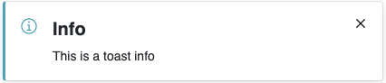
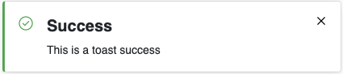
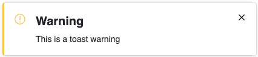
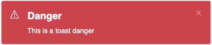

# akkurate-toast

Akkurate toast est un plugin vuejs qui sert a pouvoir afficher des toast facilement.

## Installation du plugin

- Ajouter dans le package.json du project dans lequel installer le plugin

```json
"dependencies": {
    // ...
    "akkurate-toast": "git+ssh://git@bitbucket.org/subvitaminetm/akkurate-toast.git",
    //...
  },
```

- Lancer la commande `npm i akkurate-toast` pour installer ou mettre à jour le plugin

- Dans le app.js ajouter

```javascript
import AkkToast from "akkurate-toast";
Vue.use(AkkToast);
```

## Utilisation



```javascript
this.$toast("Info", "This is a toast info", { timeout: 1500, type: "info" });
```



```javascript
this.$toast("Success", "This is a toast success", {
  timeout: 1500,
  type: "success",
});
```



```javascript
this.$toast("Warning", "This is a toast warning", {
  timeout: 1500,
  type: "warning",
});
```



```javascript
this.$toast("Danger", "This is a toast danger", {
  timeout: 1500,
  type: "danger",
});
```

## Commandes

- `serve` : Lance le serveur de dévelopement.
- `build` : Build les components
- `build:ssr` : Build les components pour le ssr (server side rendering)
- `build:es` : Build les components es (Pour le developement)
- `build:unpkg` : Build les components pour la prod
